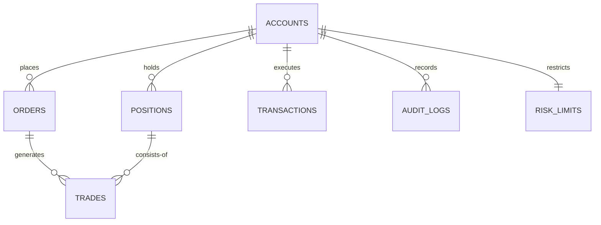

# 🌐 TỔNG QUAN HỆ THỐNG GIAO DỊCH HÀNG HÓA PHÁI SINH (MVX TRADING SYSTEM)

Chào mừng bạn đến với tài liệu **Tổng Quan Hệ Thống (System Overview)** của sàn giao dịch hàng hóa phái sinh MVX. Tài liệu này được thiết kế để giúp các nhà phát triển, quản trị viên và các bên liên quan nhanh chóng nắm bắt cấu trúc, kiến trúc dữ liệu, luồng nghiệp vụ cốt lõi và các công thức tài chính quan trọng của hệ thống.

---

## 🎯 1. Mục Tiêu & Sứ Mệnh Hệ Thống

Hệ thống MVX (Derivatives Trading System) được xây dựng nhằm cung cấp một nền tảng giao dịch hàng hóa phái sinh hoàn chỉnh, hiệu năng cao, bảo mật và thời gian thực (real-time). Hệ thống hỗ trợ đầy đủ các tính năng:
*   **Quản lý tài khoản (Account & KYC)**: Đăng ký, xác minh danh tính (KYC), liên kết tài khoản ngân hàng.
*   **Quản lý dòng tiền (Cash Management)**: Nộp, rút tiền và tự động đối soát giao dịch ngân hàng.
*   **Hệ thống xử lý lệnh (OMS - Order Management System)**: Tạo, cập nhật, hủy bỏ các loại lệnh giao dịch (Market, Limit, Stop, Stop-Limit).
*   **Động cơ quản lý rủi ro (Risk Engine)**: Kiểm tra ký quỹ (Margin), giới hạn vị thế (Position Limit), mức độ rủi ro (Exposure) và tự động kích hoạt cuộc gọi ký quỹ (Margin Call) hoặc thanh lý tài sản cưỡng bức (Forced Liquidation).
*   **Báo cáo & Lịch sử**: Lưu vết lịch sử lệnh, lịch sử khớp lệnh (Trades) và lịch sử hoạt động hệ thống (Audit Logs).

---

## 🏗️ 2. Kiến Trúc Hệ Thống Tổng Quan

Hệ thống được thiết kế theo mô hình phân tầng hướng sự kiện (Event-Driven Architecture), đảm bảo tính module hóa và dễ dàng mở rộng.

```
                   ┌───────────────────────────────────┐
                   │        CLIENT APPLICATIONS        │
                   │ (React Web App, Mobile, Desktop)  │
                   └─────────────────┬─────────────────┘
                                     │
                     ┌───────────────┴───────────────┐
                     ▼                               ▼
          ┌────────────────────┐          ┌────────────────────┐
          │   REST API Layer   │          │  WebSocket Server  │
          │    (Express.js)    │          │    (Real-time)     │
          └──────────┬─────────┘          └──────────┬─────────┘
                     │                               │
                     └───────────────┬───────────────┘
                                     ▼
                      ┌─────────────────────────────┐
                      │    API Gateway / Auth &     │
                      │   Rate Limiting Middleware  │
                      └──────────────┬──────────────┘
                                     │
       ┌─────────────────────────────┼─────────────────────────────┐
       ▼                             ▼                             ▼
┌──────────────┐              ┌──────────────┐              ┌──────────────┐
│ Account Serv │              │  Order Serv  │              │Position Serv │
│ - Profile    │              │  - Validate  │              │ - Open/Close │
│ - KYC        │              │  - Queueing  │              │ - P&L Calc   │
│ - Cash Flow  │              │  - Execution │              │ - History    │
└──────┬───────┘              └──────┬───────┘              └──────┬───────┘
       │                             │                             │
       └─────────────────────────────┼─────────────────────────────┘
                                     ▼
                      ┌─────────────────────────────┐
                      │     RISK ENGINE (Core)      │
                      │  - Margin Validation        │
                      │  - Exposure Limits Check    │
                      │  - Forced Liquidation       │
                      └──────────────┬──────────────┘
                                     │
                                     ▼
                      ┌─────────────────────────────┐
                      │      MONGODB DATABASE       │
                      │ - Accounts   - Orders       │
                      │ - Positions  - Trades       │
                      │ - Transactions - AuditLogs  │
                      └─────────────────────────────┘
```

### ⚡ Các Phân Hệ Core
1.  **Client Application**: Phát triển trên nền tảng **React 18 + TypeScript + Tailwind CSS**, cập nhật trạng thái thời gian thực thông qua kết nối WebSocket.
2.  **REST API (Express.js)**: Điểm tiếp nhận mọi yêu cầu xử lý từ giao diện như nạp/rút tiền, tạo/hủy lệnh, xem báo cáo lịch sử.
3.  **WebSocket Layer (Socket.io)**: Cập nhật biến động giá thị trường, trạng thái lệnh mới nhất, cập nhật lãi/lỗ (PnL) thời gian thực của vị thế và cảnh báo ký quỹ cho người dùng.
4.  **Risk Engine (Trái tim hệ thống)**: Liên tục giám sát tài khoản của khách hàng để đảm bảo tiền ký quỹ luôn nằm trong ngưỡng an toàn trước khi đặt lệnh và trong suốt quá trình giữ vị thế.

---

## 🔁 3. Luồng Nghiệp Vụ Cốt Lõi (Core Business Flows)

### 3.1. Vòng Đời của một Tài Khoản
```
[Đăng ký tài khoản] ➔ [Xác thực danh tính KYC] ➔ [Liên kết Ngân hàng] ➔ [Nộp tiền ký quỹ] ➔ [Tài khoản ACTIVE]
```

### 3.2. Luồng Xử Lý Lệnh và Khớp Lệnh (Order Lifecycle)
Mỗi khi khách hàng gửi một lệnh giao dịch mới, hệ thống sẽ trải qua quy trình nghiêm ngặt sau:

```
1. Khách hàng gửi Lệnh mua/bán (Symbol, Qty, Side, OrderType, Price)
   │
   ▼
2. OMS kiểm tra định dạng dữ liệu (Validation) & Xác thực quyền truy cập
   │
   ▼
3. Risk Engine kiểm tra Rủi ro trước khi khớp lệnh (Pre-Trade Risk):
   ├─ Check 1: Số dư khả dụng có đủ để thực hiện ký quỹ (Margin Required)?
   ├─ Check 2: Vị thế sau khi khớp có vượt quá giới hạn vị thế tối đa (Max Position Limit)?
   └─ Check 3: Giá trị chịu rủi ro có vượt trần (Max Exposure)?
   │
   ▼
4. Lệnh HỢP LỆ ➔ Chuyển trạng thái sang "CREATED" & đóng băng số tiền ký quỹ tạm tính (Frozen Amount)
   │
   ▼
5. Gửi lệnh lên sàn MXV (hoặc Động cơ khớp lệnh giả lập)
   │
   ▼
6. Sàn nhận lệnh ➔ Trạng thái chuyển thành "SUBMITTED" ➔ "PENDING_MATCH"
   │
   ▼
7. Khớp lệnh thành công (Filled) ➔ Tạo Bản ghi Giao dịch (Trade)
   │
   ├─ Tạo mới hoặc cập nhật vị thế (Position): Entry Price, Quantity, Margin Used
   ├─ Cập nhật tài khoản (Account): Khấu trừ Số tiền ký quỹ đóng băng thực tế, cập nhật số dư khả dụng
   └─ Lưu trữ nhật ký hệ thống (Audit Logs)
   │
   ▼
8. Phát tín hiệu thời gian thực (WebSocket) thông báo tới Client cập nhật UI
```

---

## 📊 4. Các Công Thức Tài Chính & Nghiệp Vụ Quản Lý Rủi Ro

Đây là phần tối quan trọng đối với các kỹ sư phát triển để đảm bảo tính chính xác tuyệt đối trong khâu tính toán tài chính của hệ thống giao dịch.

### 4.1. Ký quỹ (Margin)
Đầu tư phái sinh sử dụng đòn bẩy lớn nên hệ thống phải giám sát tỷ lệ ký quỹ liên tục.

*   **Margin Required (Số tiền ký quỹ yêu cầu để mở vị thế)**:
    $$\text{Margin Required} = \text{Quantity} \times \text{Price} \times \text{Margin Ratio}$$
    *(Ví dụ: Mua 10 lô Vàng ở giá \$2,100, tỷ lệ ký quỹ yêu cầu của sàn là 10% (đòn bẩy 1:10) $\rightarrow$ Tiền ký quỹ yêu cầu = $10 \times 2,100 \times 10\% = \$2,100$)*.

*   **Available Balance (Số dư khả dụng để giao dịch hoặc rút)**:
    $$\text{Available Balance} = \text{Account Balance} - \text{Frozen Amount}$$
    *(Trong đó `Frozen Amount` là tổng số tiền đang bị khóa để ký quỹ cho các vị thế đang mở và các lệnh đang chờ khớp)*.

### 4.2. Lợi Nhuận/Thua Lỗ Tạm Tính (Unrealized P&L)
Được tính toán liên tục dựa trên giá thị trường hiện tại (Current Market Price - Last Price).

*   **Vị thế MUA (LONG Position)**:
    $$\text{Unrealized P\&L} = (\text{Current Price} - \text{Entry Price}) \times \text{Quantity} \times \text{Contract Size}$$

*   **Vị thế BÁN (SHORT Position)**:
    $$\text{Unrealized P\&L} = (\text{Entry Price} - \text{Current Price}) \times \text{Quantity} \times \text{Contract Size}$$

### 4.3. Quản Lý Rủi Ro & Thanh Lý Vị Thế (Forced Liquidation)
Hệ thống sử dụng tỷ lệ **Margin Level (Mức Ký Quỹ)** để đánh giá mức độ an toàn của tài khoản:

$$\text{Margin Level} = \left( \frac{\text{Account Balance} + \text{Unrealized P\&L}}{\text{Frozen Amount}} \right) \times 100\%$$

| Mức độ Margin Level | Trạng thái Tài khoản | Hành động của Hệ thống |
| :--- | :--- | :--- |
| **$\ge 100\%$** | **Safe (An toàn)** | Hoạt động bình thường. Cho phép rút tiền (đối với phần khả dụng) và mở vị thế mới. |
| **$50\% \le \text{Margin Level} < 100\%$** | **Margin Call (Gọi ký quỹ)** | Hệ thống gửi cảnh báo yêu cầu nạp thêm tiền hoặc tự động đóng bớt vị thế. Khóa tính năng mở vị thế mới. |
| **$< 50\%$** | **Forced Liquidation (Thanh lý cưỡng bức)** | **Nguy cấp!** Risk Engine tự động kích hoạt lệnh Market đóng toàn bộ các vị thế đang mở (ưu tiên đóng vị thế lỗ nhiều nhất trước) để thu hồi ký quỹ và đưa tỷ lệ an toàn về lại $\ge 100\%$. |

---

## 🗄️ 5. Kiến Trúc Cơ Sở Dữ Liệu (MongoDB Schema)

Hệ thống lưu trữ dữ liệu tập trung trong MongoDB với 8 Collection chính được liên kết chặt chẽ:



### Chi tiết các thực thể chính
1.  **`accounts`**: Lưu trữ hồ sơ người dùng, thông tin KYC, số dư hiện tại (`balance`), số dư bị đóng băng (`frozenAmount`), và danh sách ngân hàng liên kết.
2.  **`orders`**: Ghi nhận toàn bộ thông tin lệnh giao dịch, lịch sử cập nhật trạng thái (flowLog), và kết quả kiểm tra rủi ro từ Risk Engine.
3.  **`positions`**: Giám sát vị thế đang mở, hướng vị thế (LONG/SHORT), giá vào lệnh trung bình (`entryPrice`), số tiền ký quỹ đã sử dụng (`marginUsed`), và P&L thời gian thực.
4.  **`trades`**: Lưu trữ các giao dịch đã khớp thực tế trên thị trường, làm cơ sở để tính phí giao dịch và đối soát.
5.  **`transactions`**: Ghi lại lịch sử nạp/rút tiền của khách hàng, trạng thái đối soát đối với tài khoản ngân hàng ngân hàng.
6.  **`auditLogs`**: Hệ thống nhật ký bảo mật không thể sửa đổi (immutable), ghi lại chi tiết mọi hành vi nhạy cảm của người dùng (Đăng nhập, thay đổi thông tin cá nhân, sửa đổi cấu hình hệ thống).
7.  **`products`**: Quản lý danh mục hàng hóa giao dịch (Vàng, Dầu thô, Cà phê, Lúa mỳ), mã hợp đồng (GCZ24, WZ24), hệ số nhân hợp đồng (Contract Size) và tỷ lệ ký quỹ tương ứng.
8.  **`riskLimits`**: Lưu trữ cấu hình giới hạn rủi ro dành riêng cho từng tài khoản (Tỷ lệ đòn bẩy tối đa, giới hạn khối lượng tối đa trên một lệnh).

---

## 📁 6. Cấu Trúc Mã Nguồn Dự Án (Project Structure)

Dự án được phân tách rõ ràng giữa Front-end và Back-end, giúp tối ưu hóa quá trình làm việc nhóm cũng như triển khai CI/CD.

```
mvx-trading-system/
├── client/                     # FRONT-END (React 18 + TS + Vite)
│   ├── src/
│   │   ├── components/         # Các thành phần tái sử dụng (Layout, Header, OrderForm, StatsCard, v.v.)
│   │   ├── pages/              # Các trang chính (Dashboard, Orders, Positions, Transactions, Login, v.v.)
│   │   ├── services/           # Kết nối API (HTTP Axios & WebSocket Client Socket.io)
│   │   ├── store.ts            # Quản lý trạng thái toàn cục (Zustand)
│   │   └── globals.css         # Cấu hình giao diện tối (Dark-theme) & Tailwind CSS
│   └── Dockerfile              # Cấu hình đóng gói container cho Front-end
│
├── src/                        # BACK-END (Node.js + Express.js)
│   ├── config/                 # Cấu hình kết nối DB (database.js), ghi log (logger.js)
│   ├── models/                 # Mongoose Schemas (6 thực thể dữ liệu chính)
│   ├── services/               # Chứa logic nghiệp vụ cốt lõi (OrderService, RiskService, AuditService)
│   ├── controllers/            # Tiếp nhận request HTTP, gọi Service và trả về response
│   ├── middleware/             # Xác thực (Auth JWT), kiểm tra đầu vào (Validators), phân quyền (RBAC)
│   ├── jobs/                   # Các tiến trình nền tự động chạy định kỳ (Settlement EOD, Margin Call Job)
│   ├── app.js                  # Cấu hình cài đặt Express app
│   └── server.js               # Điểm khởi chạy của server Backend
│
├── docs/                       # Tài liệu hướng dẫn chi tiết dự án (50+ trang)
├── docker-compose.yml          # Cấu hình triển khai nhanh toàn bộ hệ thống bằng Docker
└── README.md                   # Hướng dẫn nhanh cho nhà phát triển mới
```

---

## 🚀 7. Hướng Dẫn Khởi Chạy Nhanh & Trải Nghiệm Hệ Thống

Để khởi chạy toàn bộ hệ thống (bao gồm Frontend, Backend và database giả lập) chỉ trong 3 bước:

### Bước 1: Khởi động cơ sở dữ liệu MongoDB
Hãy chắc chắn rằng bạn đã bật MongoDB trên local hoặc có chuỗi kết nối MongoDB Atlas hợp lệ.

### Bước 2: Cài đặt & Khởi động Backend
```bash
# Di chuyển vào thư mục dự án
cd mvx-trading-system

# Cài đặt thư viện
npm install

# Tạo file môi trường
cp .env.example .env

# Khởi chạy server ở chế độ dev
npm run dev
# Server sẽ khởi chạy tại: http://localhost:3000
```

### Bước 3: Cài đặt & Khởi động Frontend
```bash
# Mở một terminal mới và đi vào thư mục client
cd client

# Cài đặt thư viện
npm install

# Khởi chạy ứng dụng
npm start
# Ứng dụng chạy tại địa chỉ: http://localhost:5173
```

### 👤 Tài khoản thử nghiệm có sẵn
*   **Email**: `demo@mvx.com`
*   **Password**: `Demo123!`

---

## 🛠️ 8. Mẹo Gỡ Lỗi & Giám Sát Nhanh (Debugging & Monitoring)

1.  **Theo dõi tiến trình đặt lệnh (Order Flow)**:
    Khi phát triển hoặc kiểm thử, bạn có thể kiểm tra trực tiếp thuộc tính `flowLog` trong Collection `orders` của MongoDB để xem lệnh đang bị tắc nghẽn hoặc từ chối ở bước nào:
    ```javascript
    // Tiến trình chuẩn:
    // OMS: CREATED ➔ RISK: PASSED ➔ EXCHANGE: SUBMITTED ➔ EXCHANGE: FILLED
    ```
2.  **Xem log hệ thống**:
    Hệ thống sử dụng thư viện log có cấu trúc cao **Pino**. Để xem log chi tiết thời gian thực khi chạy local:
    ```bash
    npm run dev | npx pino-pretty
    ```
3.  **Kiểm tra tính toán rủi ro**:
    Bạn có thể chạy thử kiểm tra Margin Call và Forced Liquidation thủ công thông qua tiến trình lập lịch trong thư mục `src/jobs/marginCallJob.js` bằng cách thay đổi giá thị trường của các sản phẩm phái sinh để giả lập biến động giá mạnh.

---

> [!NOTE]  
> Tài liệu này được biên soạn bởi **Antigravity AI Assistant** nhằm mang lại cái nhìn toàn diện, ngắn gọn và trực quan nhất cho nhà phát triển hệ thống MVX. Nếu bạn có bất kỳ thắc mắc nào về cách hoạt động của phần nào, vui lòng trao đổi trực tiếp trong cửa sổ chat! 📈🚀
